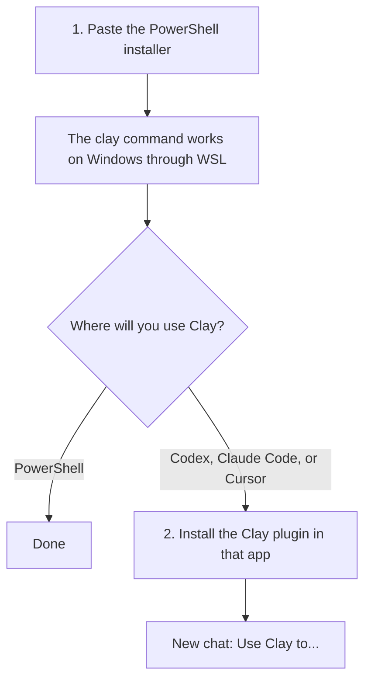

# Clay CLI for Windows

Use Clay from PowerShell, Codex, Claude Code, or Cursor on Windows.

> [!IMPORTANT]
> **You do not need to install the Clay CLI first or clone Clay's GitHub repository.**
>
> Start with the single PowerShell command below. It obtains Clay's official CLI and makes it work on Windows.
>
> Already installed another `clay` command? That is okay. The installer detects it, leaves it untouched, and puts this Windows bridge first in your user PATH.

## The whole setup



There are only **two things** to understand:

| Name used in this guide | What it is | Do you need it? |
| --- | --- | --- |
| **Windows bridge** | Installs the `clay` command and runs Clay's official CLI through WSL | Yes, on Windows |
| **Clay plugin** | Teaches Codex, Claude Code, or Cursor how to use Clay | Yes for those apps; no for PowerShell-only use |

**Clay plugin**, **agent plugin**, and **app plugin** are different names for the same installed Clay integration. This guide uses **Clay plugin** consistently.

`clay-run/agent-plugins` is the GitHub marketplace repository that contains the Clay plugin. It is not another plugin you must install.

The **Windows bridge is not a plugin**. It is only the adapter that makes the Clay CLI run on Windows.

Why start with the bridge? An older or different `clay` command can otherwise appear first on Windows' PATH, causing the coding app to call the wrong installation. Starting here avoids that conflict; it is not because installing Clay first damages anything.

## What is WSL?

WSL means **Windows Subsystem for Linux**. It is a Microsoft feature that lets Windows run Linux programs quietly in the background.

Clay does not currently provide a native Windows executable, so the bridge runs Clay's official Linux CLI through WSL. You stay in Windows: there is no dual boot, no replacement of Windows, and no Linux interface you need to learn.

The installer configures WSL for you. Windows may ask for administrator approval or one restart.

## 1. Install the Windows bridge

Open the Windows **Start** menu, type **PowerShell**, open it, and paste this entire line:

```powershell
irm https://raw.githubusercontent.com/danielkupka/clay-cli-windows/v0.2.0/install.ps1 | iex
```

Press **Enter** and follow the messages:

- Sign in if a Clay page opens in your browser.
- Approve the Windows prompt if WSL needs to be enabled.
- If Windows requests a restart, restart it and paste the same command again.

Then close PowerShell, open it again, and check:

```powershell
clay whoami
```

If it shows your Clay user and workspace, the Windows bridge is ready.

Want to use Clay only through PowerShell? You can stop here and run `clay --help`.

## 2. Install the Clay plugin in your app

Do this only if you want to ask for Clay work inside Codex, Claude Code, or Cursor. The plugin is installed **in the coding app**, not in Clay's website.

### Codex

Run this in PowerShell:

```powershell
codex plugin marketplace add clay-run/agent-plugins
```

Open **Plugins** in Codex, install **clay**, then fully quit and reopen Codex.

### Claude Code

Run these inside Claude Code, one at a time:

```text
/plugin marketplace add clay-run/agent-plugins
/plugin install clay@clay-plugins
```

Fully quit and reopen Claude Code.

### Cursor

Open a Cursor Agent chat and paste:

```text
Install the Clay plugin by following https://github.com/clay-run/agent-plugins/blob/main/GETTING_STARTED.md. I use Windows and the Windows Clay CLI bridge is already installed, so verify it with `clay whoami` instead of replacing it.
```

Cursor installation can depend on your organization's plugin policy. Let the agent follow Clay's [official instructions](https://github.com/clay-run/agent-plugins/blob/main/GETTING_STARTED.md), then fully quit and reopen Cursor.

## 3. Use Clay

Open a new chat in your coding app and ask normally:

```text
Use Clay to find ten SEO agencies in Hamburg and identify two decision-makers at each.
```

Or name the Clay skills explicitly:

```text
Use $clay:search to find the companies, then $clay:audiences to save the contacts.
```

For every future chat, just start with **"Use Clay to..."**. You do not need to mention Windows, WSL, this wrapper, or the GitHub repository again.

## How to know everything works

- `clay whoami` shows your Clay account in a new PowerShell window.
- The Clay plugin appears in your coding app.
- A new chat recognizes a request beginning with **"Use Clay to..."**.

## Do I run `clay:setup`?

Usually, **no**. Clay's official guide covers several operating systems and normally asks the plugin's setup skill to install the CLI, configure PATH, and sign in. This Windows installer already performs those jobs.

If `clay whoami` works and the Clay plugin appears in your app, go directly to your Clay request.

## Common problems

### Windows asks for a restart

Restart Windows and paste the same installer command into PowerShell again. Running it twice is safe.

### PowerShell says `clay` is not recognized

Close and reopen PowerShell. If that does not work, restart Windows and rerun the installer.

### The plugin is installed, but a new chat cannot see it

Fully quit and reopen the coding app. Reloading a window or opening another chat may not be enough after installing a plugin.

### I already installed the Clay plugin

Keep it. Run the Windows bridge installer, verify `clay whoami`, and restart the coding app. You do not need to reinstall the plugin.

### I already installed another Clay CLI

That is okay too. The installer does not uninstall it. It reports the existing command and places this bridge first in your user PATH.

After installation, open a new PowerShell window and run:

```powershell
Get-Command clay -All
```

The first application should be `%LOCALAPPDATA%\Programs\ClayCLI\bin\clay.cmd`. If another command still comes first, the installer prints a warning; remove that old PATH entry or rename the PowerShell alias/function it identifies.

<details>
<summary><strong>Advanced: what the installer changes</strong></summary>

1. Reuses an existing non-Docker WSL distribution or installs Ubuntu 24.04.
2. Reuses the newest official Clay launcher from a plugin cache, or downloads it from [`clay-run/agent-plugins`](https://github.com/clay-run/agent-plugins).
3. Installs a forwarder at `/usr/local/bin/clay-windows` inside WSL.
4. Creates `%LOCALAPPDATA%\Programs\ClayCLI\bin\clay.cmd` on Windows.
5. Adds that directory to the current user's `PATH`.
6. Verifies the CLI and signs in to Clay.

The forwarder finds the newest installed plugin launcher automatically after plugin upgrades.

</details>

<details>
<summary><strong>Advanced: review the script before running it</strong></summary>

If your security policy does not allow piping a downloaded script directly into PowerShell:

```powershell
Invoke-WebRequest https://raw.githubusercontent.com/danielkupka/clay-cli-windows/v0.2.0/install.ps1 -OutFile install-clay-windows.ps1
notepad .\install-clay-windows.ps1
powershell -NoProfile -ExecutionPolicy Bypass -File .\install-clay-windows.ps1
```

</details>

<details>
<summary><strong>Advanced: installer options and complex commands</strong></summary>

Download the script first, then use options if needed:

```powershell
.\install-clay-windows.ps1 -Distro Ubuntu-22.04
.\install-clay-windows.ps1 -SkipLogin
.\install-clay-windows.ps1 -SkipPathUpdate
.\install-clay-windows.ps1 -DryRun
```

For commands with complex nested JSON, bypass Windows batch quoting:

```powershell
wsl.exe -d Ubuntu-24.04 --exec /usr/local/bin/clay-windows <command> <arguments>
```

</details>

## Requirements

- Windows 10 version 2004 or newer, or Windows 11
- PowerShell 5.1 or newer
- Internet access during installation and the first CLI launch
- Permission to enable WSL if it is not already installed

## Scope and licensing

This repository contains only the Windows bridge and installer. Clay's launcher and CLI come from Clay's official repository and remain governed by Clay's terms. The wrapper code in this repository is MIT licensed.
